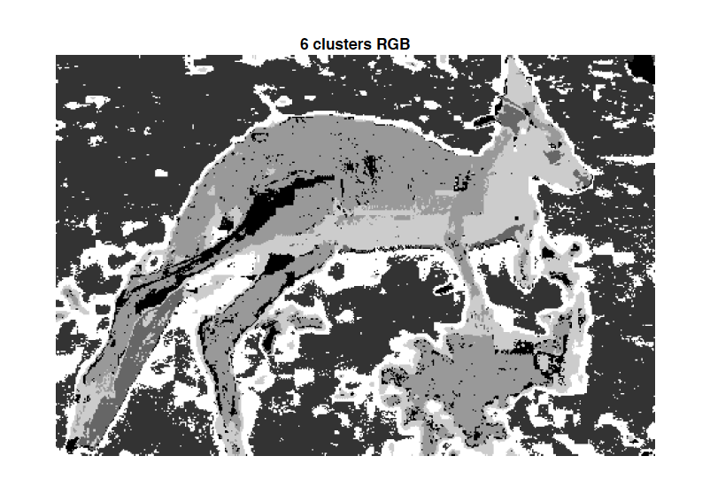

# Image Segmentation by using GMM

In this project, I practiced using Gaussian Mixture Model to segment images. EM algorithm is used for optimization. 

Here are some results

<p align="center">
  
</p>

<p align="center">
  
</p>

<p align="center">
  
</p>

<p align="center">
  
</p>

<p align="center">
  
</p>

To use GMM for this task, we have to specify the number of clusters that we want in our segmentation. This is not ideal in many situations, however, we can use cross validation to decide the number of clusters. See ```assignment2_part2.m``` for the cross validation code.
